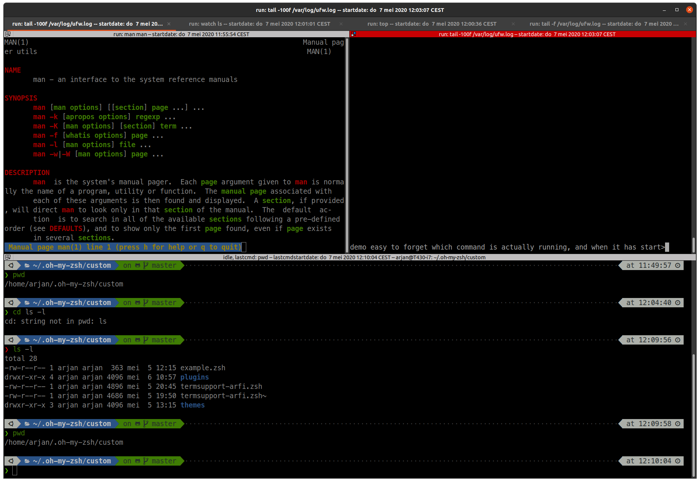

# Dynamic and more usefull terminal named with oh-my-zsh

This repo provides a customized termsupport.zsh for oh-my-zsh, which delivers more advanced information in terminal window title as standard.

## features

- Shows if command still running, or is cmdline is idle 
- when running
  - shows which command is executed (as standard)
  - shows "running:"
  - in addition shows the starttime
- when idle
  - shows username@host and working dir (as standard)
  - shows "idle: "
  - shows which last command was executed and when

Example Screenshot:


## Installation

After installing oh-my-zsh on your system, just copy the custom termsupport-custom.zsh to the oh-my-zsh custom dir and reload zsh

example on linux:

```zsh
> cp termsupport-custom.zsh ~/.oh-my-zsh/custom/
> . ~/.zshrc
```

## Ideas for improvement

Current status (2020/05/07), is basically just a quick hack to get what i needed, but i see room for new features and improvements.
a few i noticed:

- Ideas for Improvement
  - run information is stored using a global variabele and used later by idle code (remove global/in cli visable variabele)
  - command info is not filtered as the original code does (ssh)
  - starttime is not aware of jobs which where suspended(jobs), i've no urgent needs for this.
  - Limit the displayed (individual) information to a certain max length

- Ideas for additional Features
  - show user@host and working dir also in run state
  - add git repo information tot title

## Limitations

- This is a modified copy of ~/.oh-my-zsh/lib/termsupport.zsh from oh-my-zsh on 2020/05/06, so if any update there this code needs an update too
- This code focusses on window title only, as i need not see any implementation of tab title (terminator/gnome-terminal). happy to accept patches for it.

## References

- [Oh-my-zsh](https://github.com/ohmyzsh/ohmyzsh/)
- [(xterm) escape codes for renaming title and icon](https://www.xfree86.org/current/ctlseqs.html)